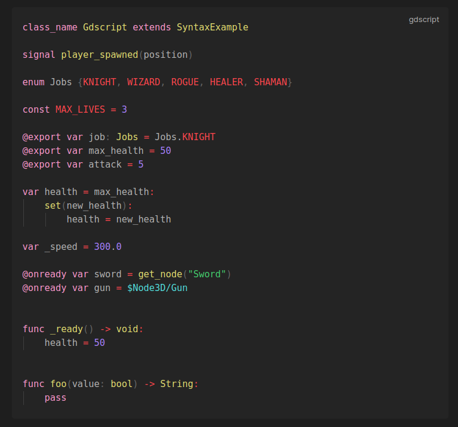

# Obsidian GDScript Syntax Highlighting Plugin

This plugin for Obsidian provides live syntax highlighting for GDScript (the language used in [Godot](https://godotengine.org/)).

An example of the highlighting can be seen below:

## Setup (manual)
The plugin is going to be submitted to the Obsidian team to hopefully be approved as a community plugin, but for now, if you wish to install the plugin manually.

1. Navigate to the vault you wish to install it in using your file explorer
2. Navigate into the `.obisidian` directory, and in there, go into the `plugins` directory
3. Create a new folder in here named `gdscript-syntax-highlighting`
4. Head over to the [Latest Release](https://github.com/RobTheFiveNine/obsidian-gdscript/releases/latest) and download the `main.js` and `manifest.json` files into the newly created folder.
5. Open the settings window in Obsidian and enable the plugin in the `Community plugins` section

## License
This Source Code Form is subject to the terms of the Mozilla Public License, v. 2.0. If a copy of the MPL was not distributed with this file, You can obtain one at https://mozilla.org/MPL/2.0/.